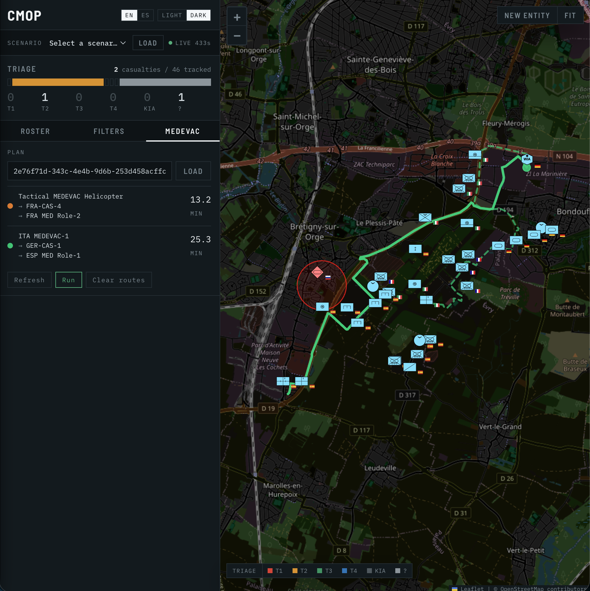

# cmop_map

CMOP (Common Medical Operational Picture) map service. Geospatial layer for military and medical entities with NATO APP-6 symbology, scenario-based data loading, and a REST API consumed by `cmop_fusion_mcp`. This project is an evolution of the [mapa-puntos-interes](https://github.com/MartinezAgullo/mapa-puntos-interes) project.

**Stack:** Node.js + Express · PostgreSQL/PostGIS (Docker) · Leaflet · vanilla JS



---

## Web UI

The panel is a map legend, not a dashboard: colour is treated as a data type, so the chrome stays graphite and the only saturated pixels on screen belong to triage, alliance and route colours.

- **Triage ladder** — a proportional bar over a six-column count scale (T1 / T2 / T3 / T4 / KIA / unknown). It is the census, the alarm and the triage filter in one object: click a band and both the roster and the map narrow to it. The same colours reappear as the left edge of every roster row and in the map legend, so one colour always means one thing.
- **Three tabs** — Roster, Filters and MEDEVAC. The roster gets every pixel below the ladder and is sorted by clinical urgency: casualties first, down the triage scale, then units by name.
- **Elapsed clocks** — casualty rows and popups carry a running time since the medical record was written. There is no injury timestamp in the schema yet, so a scenario load starts every clock together; live casualties pushed over SSE are the ones that diverge.
- **Air routes against threats** — a helicopter route that crosses a hostile unit's air-defence envelope carries the planner's advisory: clicking it opens a red **INCREASE ALTITUDE** banner naming the threat and the legs, and the MEDEVAC tab marks it under the route. With the planner in `divert` mode the route is drawn bent around the threat and the banner reads **DIVERTED ROUTE** instead.
- **Picking a plan** — every card in the MEDEVAC tab is one plan. Click it and the map zooms to that vehicle's route and fades the others, as a roster row does for an entity; click it again to see them all. The pick survives a route reload (a replan, *Refresh*, a theme change).
- **Live feed** — the dot next to the scenario selector reports the SSE stream and the seconds since the last event.
- **Language and theme** — `EN`/`ES` and `LIGHT`/`DARK`, both remembered in `localStorage`. Theme follows the operating system on a first visit. UI copy lives in `public/js/i18n.js`; nothing is hardcoded in `app.js`.

Typography follows one rule: anything read character by character (callsigns, counts, coordinates, ETAs, task IDs, clocks) is set in IBM Plex Mono, labels in Barlow Semi Condensed, prose in IBM Plex Sans.

---

## Project structure

```
cmop_map/
├── config/
│   └── database.js              # pg Pool — reads .env
├── lib/
│   ├── sse-broker.js            # Singleton SSE broadcast module (connected clients registry)
│   ├── dependency-monitor.js    # Probes postgres and the agents, logs state changes, feeds GET /health
│   ├── mascal-generator.js      # Pure, seeded random MASCAL scenario generator
│   ├── scenario-files.js        # Scenario file paths and name validation
│   ├── telemetry.js             # OpenTelemetry: traces and logs over OTLP, started first by server.js
│   └── scenario-loader.js       # Replaces the DB contents with an in-memory scenario, in one transaction
├── models/
│   └── entity.js                # All queries: puntos_interes + medical_details (LEFT JOIN)
├── routes/
│   ├── entities.js              # CRUD for entities (/api/entities) — broadcasts SSE on POST, PUT, DELETE
│   ├── medical.js               # Medical-specific ops (/api/medical)
│   ├── scenarios.js             # List & load scenarios (/api/scenarios)
│   └── schema.js                # Schema introspection (/api/schema) — for MCP servers
├── scripts/
│   ├── init-db.js               # Creates schema (enums, tables, indexes, triggers). No seed.
│   ├── load-scenario.js         # CLI loader: loads a scenario file through lib/scenario-loader.js
│   ├── generate-mascal.js       # CLI: generate and load a random MASCAL scenario
│   └── scenarios/
│       ├── valencia_urban.js    # Military-only baseline (no casualties)
│       ├── valencia_medevac.js  # Urban + 3 casualties + medical facilities
│       ├── mariupol_siege.js    # RUS vs UKR urban combat with MEDEVAC
│       └── paris_sud_medevac.js # Multinational exercise (ESP/FRA/DEU/ITA)
├── public/
│   ├── css/styles.css
│   ├── icons/                   # NATO APP-6 SVGs: friendly/ hostile/ neutral/ unknown/
│   │   └── README.md            # Icon resolution algorithm docs
│   ├── index.html
│   ├── js/i18n.js               # UI strings (en/es) + t() / applyI18n() — no copy lives in app.js
│   └── js/app.js                # Frontend: scenario selector, map, icon resolution, triage ladder,
│                                #           medical popups, SSE client, simulation controls
├── docker-compose.yml
├── server.js                    # Express entry point. Mounts routes, SSE, planner proxy.
├── package.json
└── .env
```

### Real-time layer

All entity mutations are pushed to connected browsers without page refresh via **Server-Sent Events (SSE)**:

- `lib/sse-broker.js` — singleton that keeps a `Set` of open SSE connections and exposes `broadcast(payload)`.
- `POST /api/entities` (single + batch) broadcasts `entity_created` — new entities appear on the map immediately.
- `PUT /api/entities/:id` broadcasts `entity_updated { id, lat, lng }` — marker position updates in place. When it changes a platform's `status`, it also broadcasts `entity_changed { data }`, and the marker's icon and popup are redrawn.
- `DELETE /api/entities/:id` broadcasts `entity_deleted { id }` — marker is removed from the map immediately.
- The browser `EventSource` on `/api/events` handles all three: `addEntityToMap`, `setLatLng`, `removeLayer`.
- Internal services (e.g. `medevac_planner`) can push arbitrary events via `POST /api/events/notify`.

### Key design decisions

- **`entity.js`** — single `baseSelect()` with a LEFT JOIN to `medical_details`. Every read endpoint returns `medical: {...} | null` transparently. No extra queries.
- **`medical_details`** — 1-to-1 table (FK = PK). Only exists for casualty entities. All fields nullable; defaults to `UNKNOWN`.
- **`tipo_elemento`** — Used for subtypes within categories (e.g., `infantry` + `tipo_elemento: 'mechanised'` → icon `infantry_mechanised_{country}.svg`). Medical facilities and MEDEVAC units use this for Role 1/2/3/4.
- **Scenarios** — data lives in `scripts/scenarios/*.js`. Each exports `{ meta, entities, medicalDetails }`. The loader resolves `elemento_identificado` → FK automatically. Adding a new scenario = one new file, zero schema changes.
- **Random MASCAL scenarios** — `lib/mascal-generator.js` scatters `n_casualties`, `n_evacuators` and `n_medical_facilities` within a few kilometres of a preset city (Paris, Madrid, Valencia, London, Berlin, Rome, Brussels) or a custom point. See [Random MASCAL scenarios](#random-mascal-scenarios).
- **Telemetry** — `lib/telemetry.js`, the first thing `server.js` runs, exports traces and every log line over OTLP to the OTel Collector of latacc-medevac (`docker-compose.observability.yml`, Jaeger and Loki behind it, Grafana on `:3001`). API requests continue the caller's `traceparent`, and the hooks to the planner and `pfc_agent` carry it, so a casualty added here and the planning it starts are one trace. A line written inside a trace ends with `(trace 4bf92f35)` on the terminal; on `/logs` the id filters the page to that trace and ↗ opens it in Jaeger. Static files, SSE streams, `/api/logs/*`, `/health` and the dependency probes are not traced. A Collector that is down costs only dropped telemetry. `OTEL_EXPORTER_OTLP_ENDPOINT` (default `http://localhost:4317`), `OTEL_SDK_DISABLED=true` to turn it off.
- **Errors** — every route answers a failed database call through `sendError(res, log, err, 'Failed to …')` from `lib/db-error.js` instead of its own `catch` body. PostgreSQL's error code decides the status (see the API reference); the valid values of an enum are read from the database itself (`enum_range`) and cached, so they cannot drift from `init-db.js`. The agents read `message`, so the reason there is what lets an LLM correct its own call.
- **Icon resolution** — `app.js` builds a candidate list (`category_tipo_country.svg` → `category_tipo.svg` → `category_country.svg` → `category.svg` → `default.svg`), checks with HEAD, caches.

---

## Prerequisites

- Docker Desktop
- Node.js 18+
- npm

---

## Running modes

There are two ways to run the stack. Choose one — do not mix them.

### Mode A — Docker (production / deployment)

The entire stack (PostgreSQL + backend) runs in containers.

```bash
docker compose up -d          # starts PostgreSQL + backend on :3000
docker compose down           # stop everything
```

→ `http://localhost:3000`

### Mode B — Dev (hot-reload)

Only PostgreSQL runs in Docker; the Node.js server runs locally with nodemon.

```bash
docker compose up -d postgis  # PostgreSQL only
npm run dev                   # server with hot-reload on :3000

# Stop: Ctrl+C then:
docker compose down
```

→ `http://localhost:3000`

---

## First-time setup

```bash
git clone https://github.com/MartinezAgullo/cmop_map && cd cmop_map

# 1. Dependencies
npm install

# 2. Environment
cp .env.example .env          # edit DB_PASSWORD at minimum

# 3. PostgreSQL only (dev mode)
docker compose up -d postgis

# Wait for PostgreSQL to be ready
until docker exec cmop_map_postgis pg_isready -U postgres >/dev/null 2>&1; do
    sleep 1
done

# 4. Schema
node scripts/init-db.js

# 5. Load scenario
node scripts/load-scenario.js paris_sud_medevac

# 6. Start server
npm run dev
```

→ `http://localhost:3000`

---

## Daily workflow (dev mode)

```bash
docker compose up -d postgis  # PostgreSQL only
npm run dev                   # server (hot-reload)

# Swap scenarios (no restart needed)
node scripts/load-scenario.js paris_sud_medevac

# List scenarios
node scripts/load-scenario.js --list
```

### Random MASCAL scenarios

```bash
node scripts/generate-mascal.js --preset paris --casualties 30 --evacuators 12 --facilities 4 --seed 42
node scripts/generate-mascal.js --lat 48.6 --lng 2.34 --casualties 20 --evacuators 8
node scripts/generate-mascal.js --presets
```

The map offers the same thing under **Random**, next to the scenario selector. Both load the scenario straight into the database and tell a running planner (`POST /scenario/loaded`), so it replans on the new casualties. Nothing is written to disk and generated scenarios do not appear in the scenario selector: to get one back, generate it again with the same seed and counts. Whoever needs to know which one is loaded reads `GET /api/scenarios/current`.

Attributes follow skewed distributions, apportioned (largest remainder) so the proportions hold at any size rather than drifting as independent draws would: casualties 45 % GREEN, 30 % YELLOW, 15 % RED, 5 % T4 expectant (BLUE) and 5 % KIA (BLACK); vehicle roles 1 to 4 in the triangular 4:3:2:1 of `optimizacion-annealing/evacuaciones_medevac_2.ipynb`, 80 % ground and 20 % air; facilities the same 4:3:2:1, with one of each role guaranteed when there are four or more; one vehicle in three with `capacity: 2`, the rest 1. Casualties come in incidents of about eight, each within 300 m of its centre; facilities sit in the outer half of the radius. Below four facilities, at least one role-2 facility is guaranteed, and when there is a RED casualty one role-2+ vehicle, since doctrine requires both for T1.

Two limits. Positions are not snapped to roads, so an entity can land where no vehicle reaches; the planner then reports it as needing manual extraction. And the demo's Valhalla tiles cover Île-de-France only: outside Paris, ground routes need tiles for that region, or the planner's straight-line fallback.

`npm test` runs the generator's tests (`node:test`, no dependencies).

Stop: `Ctrl+C` then `docker compose down`

---

## Movement simulation

Once a MEDEVAC plan has been computed by `medevac_planner` and its routes loaded in the MEDEVAC tab, the map can animate vehicles and casualties along their GeoJSON routes in real time.

### Controls

| Button | State | Action |
|--------|-------|--------|
| **Run** | idle | Start simulation from the beginning |
| **Stop** | running | Pause simulation; vehicles freeze at current position |
| **Resume** | paused | Resume from current position (works on updated routes after threat reroute) |
| **Restart** | paused | Stop, restore original positions, restart from scratch |

The "Restart" button is only visible while paused. Labels follow the language toggle, so in Spanish these read Simular, Detener, Reanudar and Reiniciar.

### How it works

The simulation engine runs in `medevac_planner/task_server.py` as an asyncio background task:

1. **Interpolation** — vehicle positions are computed geometrically along each GeoJSON `LineString` using haversine arc-length parameterisation. No GPS involved.
2. **Speed** — ETAs from the planner encode the vehicle type: ground vehicles (`~40 km/h`), helicopters (`~150 km/h`). The `PLANNER_SIMULATION_SPEED` multiplier compresses wall-clock time (e.g. `30` = 30× speed for demos).
3. **1 Hz updates** — the planner writes each vehicle's new `(latitud, longitud)` to the CMOP DB via `PUT /api/entities/:id` every second. The SSE broker pushes `entity_updated` to all connected browsers, which call `marker.setLatLng()`.
4. **Milestones** — on arrival at the casualty (`pickup_done`), `evac_stage` is set to `in_transit` and the casualty begins co-moving with the vehicle. On arrival at the facility, `evac_stage` is set to `delivered`.
5. **Threat reroute + resume** — when a threat is added and routes are recomputed, the planner fetches the vehicle's live DB position and uses it as the new route start. Pressing "Resume" after the reroute therefore places the vehicle at position 0 of the new route, which is exactly where it was when paused.

### Demo flow

```
1. Load scenario → trigger medevac_planner → paste the task ID in the MEDEVAC tab and Load
2. Click Run — vehicles animate toward casualties, then toward facilities
3. Click Stop — vehicles freeze
4. Add hostile entity in cmop_map — planner auto-reroutes around the threat
5. Click Resume — vehicles continue from their paused position along the NEW route
```

---

## API reference

All endpoints return: `{ success: boolean, data?: any, message?: string }`

Errors (`lib/db-error.js`): a database error caused by the request is a 4xx whose `message` names the bad value and, for an enum, the valid ones, e.g. `400 Failed to fetch by triage color: "PURPLE" is not a valid triage_color; valid values: RED, YELLOW, GREEN, BLUE, BLACK, UNKNOWN` (also `400` for a non-numeric id, a missing required field, a broken reference or check; `409` for a duplicate). An unreachable PostgreSQL is a `503` that says where it was looked for. Anything else stays `500` with `message` and the database's reason in `error`. 4xx are logged as warnings, 5xx as errors with the stack.

### Entities (`/api/entities`)

All responses include `medical: {...} | null` when entity has a medical record.

#### **GET** `/api/entities`

Get all entities.

**Response:**
```json
{
  "success": true,
  "data": [
    {
      "id": 1,
      "nombre": "ESP INF-A",
      "categoria": "infantry",
      "country": "Spain",
      "alliance": "friendly",
      "tipo_elemento": "standard",
      "latitud": 39.4745,
      "longitud": -0.3768,
      "medical": null
    }
  ]
}
```

#### **GET** `/api/entities/:id`

Get single entity by ID.

#### **GET** `/api/entities/categoria/:categoria`

Filter by category.

**Parameters:**
- `categoria` (path) — e.g., `infantry`, `casualty`, `medical_facility`

**Example:** `GET /api/entities/categoria/casualty`

#### **GET** `/api/entities/cerca/:lng/:lat?radio=N`

Spatial radius query.

**Parameters:**
- `lng`, `lat` (path) — Coordinates
- `radio` (query) — Radius in meters (default: 50000)

**Example:** `GET /api/entities/cerca/-0.3768/39.4745?radio=1000`

#### **GET** `/api/entities/meta/categorias`

Get all category enum values.

**Response:** `{ success: true, data: ["infantry", "armoured", ...] }`

#### **POST** `/api/entities`

Create entity. Can include `medical` object.

**Request:**
```json
{
  "nombre": "New Unit",
  "categoria": "infantry",
  "country": "Spain",
  "alliance": "friendly",
  "tipo_elemento": "mechanised",
  "latitud": 39.47,
  "longitud": -0.38,
  "medical": {
    "triage_color": "GREEN",
    "casualty_status": "WIA"
  }
}
```

**Required:** `nombre`, `categoria`, `latitud`, `longitud`

#### **POST** `/api/entities/batch`

Bulk create.

**Request:** `{ "entities": [ {...}, {...} ] }`

#### **PUT** `/api/entities/:id`

Partial update. Can include `medical` object.

**Request:**
```json
{
  "observaciones": "Updated",
  "medical": {
    "evac_stage": "delivered"
  }
}
```

A PUT that carries only `latitud`/`longitud` does not notify the planner about a casualty: the movement simulation sends one per second while a casualty is carried. Any other change to a casualty does.

`status` (`operational` | `damaged`) is the operational status of an evacuation platform; NULL reads as operational. When a PUT changes it, the MEDEVAC planner is told (`POST {MEDEVAC_PLANNER_URL}/assets/status` with `{id, name, status, previous_status, lat, lng, tipo_elemento}`) and hands the casualties of a damaged vehicle to other vehicles. The popup of a friendly MEDEVAC or CASEVAC platform has a **Mark damaged** / **Back in service** button that sends it. A damaged platform is drawn with its `_damaged` icon (`medevac_role_2_air_damaged_spain.svg` and so on, down to `medevac_damaged.svg`).

#### **DELETE** `/api/entities/:id`

Delete entity (medical cascades).

---

### Medical (`/api/medical`)

#### **GET** `/api/medical/casualties`

Get all entities with medical records.

#### **GET** `/api/medical/triage/:color`

Filter by triage color.

**Parameters:** `color` — `RED`, `YELLOW`, `GREEN`, `BLACK`, `UNKNOWN`

**Example:** `GET /api/medical/triage/RED`

#### **GET** `/api/medical/evac-stage/:stage`

Filter by evacuation stage.

**Parameters:** `stage` — `at_poi`, `in_transit`, `delivered`, `unknown`

#### **PUT** `/api/medical/:entity_id`

Upsert medical fields (partial).

**Request:**
```json
{
  "triage_color": "YELLOW",
  "evac_stage": "in_transit",
  "destination_facility_id": 5
}
```

#### **POST** `/api/medical/:entity_id/vitals`

Append vital signs reading.

**Request:**
```json
{
  "hr": 95,
  "bp": "120/80",
  "spo2": 98,
  "recorded_at": "2026-02-06T14:30:00Z"
}
```

#### **DELETE** `/api/medical/:entity_id`

Remove medical record (entity stays).

---

### Scenarios (`/api/scenarios`)

#### **GET** `/api/scenarios`

List scenarios.

**Response:**
```json
{
  "success": true,
  "data": [
    {
      "name": "valencia_urban",
      "description": "Urban combat...",
      "tags": ["military", "urban"]
    }
  ]
}
```

#### **GET** `/api/scenarios/current`

Which scenario the tables were last loaded from, kept in the one-row `loaded_scenario` table that every load (the CLI loader, the map's *Load* and *Random*) rewrites in the same transaction as the entities. Map edits made after the load are not tracked: `loaded_at` is when the tables last matched the scenario. `data` is `null` before the first load. A reader of `/api/entities` uses it to name what it read; the QUBO in `optimizacion-annealing` refuses a map holding another scenario than the one it was asked for.

**Response:** `{ "success": true, "data": { "name": "random_mascal_paris_s42", "meta": { ... }, "loaded_at": "2026-10-01T18:44:18.467Z" } }`

#### **GET** `/api/scenarios/presets`

Centres the random MASCAL generator knows, and its limits.

#### **POST** `/api/scenarios/generate`

Generate a random MASCAL scenario and load it (truncates tables, writes no file) and notify the planner as `load` does. Body: `{ preset | lat + lng, n_casualties, n_evacuators, n_medical_facilities, radius_km, seed }`, every field optional. 400 on invalid input, with the reason.

**Response:** `{ "success": true, "scenario": "random_mascal_paris_s42", "meta": { ..., "generated": { "seed": 42, "triage_mix": {...}, "evacuation_slots": 20 } }, "loaded": { "entities": 46, "medicalRecords": 30 } }`

#### **POST** `/api/scenarios/load/:name`

Load scenario (truncates tables).

**Example:** `POST /api/scenarios/load/paris_sud_medevac`

On success this also fires `POST /scenario/loaded` at `medevac_planner`
(`MEDEVAC_PLANNER_URL`, default `:8400`). The truncate invalidates every entity
id the planner holds, so that call is what makes it drop its plans, routes and
running simulations and re-brief against the new map. Fire-and-forget: a planner
that is down logs a warning and the load still succeeds. Note that the CLI path
(`node scripts/load-scenario.js <name>`) does not notify anyone, which is what
`launch.sh` wants — it loads the scenario before the planner is even up.

**Response:**
```json
{
  "success": true,
  "message": "Scenario loaded",
  "data": {
    "entities_loaded": 45,
    "medical_records_loaded": 7
  }
}
```

---

### Real-time events (`/api/events`)

#### **GET** `/api/events`

Open an SSE stream. The connection stays alive; the server pushes events as JSON on each line.

```
data: {"type":"connected"}

data: {"type":"entity_updated","id":3,"lat":48.862,"lng":2.347}

data: {"type":"simulation_stopped","task_id":"abc123","reason":"cancelled"}
```

Event types:

| `type` | When | Fields |
|--------|------|--------|
| `connected` | On stream open | — |
| `entity_created` | After `POST /api/entities` (single or batch) | `data` (full entity object) |
| `entity_updated` | After `PUT /api/entities/:id` | `id`, `lat`, `lng` |
| `entity_changed` | After a `PUT /api/entities/:id` that changed `status` | `data` (full entity object) |
| `entity_deleted` | After `DELETE /api/entities/:id` | `id` |
| `evac_stage_updated` | At pickup / delivery milestones | `id`, `evac_stage` |
| `route_updated` | After threat-triggered reroute | `task_id` |
| `simulation_stopped` | On stop or completion | `task_id`, `reason` (`cancelled`\|`completed`) |

#### **POST** `/api/events/notify`

Push an arbitrary event to all connected SSE clients. Used internally by `medevac_planner`.

**Request:** any JSON object with a `type` field.

---

### Planner proxy (`/api/planner`)

Thin proxies to `medevac_planner` task server (default `:8400`). Avoids CORS issues.

#### **GET** `/api/planner/assignments`

Every live assignment of the planner: `{assignments: [{plan_key, task_id, stage, asset_id, asset_name, casualty_id, casualty_name, triage, destination_name}]}`, where `stage` is `to_pickup` or `in_transit`. The popup of a friendly evacuation platform that is not damaged asks for it each time it opens and shows the vehicle as free or assigned, with each casualty it is going for or carrying. 502 when the planner is down; the popup then says the state is unknown.

#### **GET** `/api/planner/tasks/:taskId/routes`

Fetch GeoJSON routes for a completed plan.

#### **POST** `/api/planner/tasks/:taskId/simulate`

Start movement simulation for a plan.

#### **DELETE** `/api/planner/tasks/:taskId/simulate`

Stop (pause) a running simulation.

#### **POST** `/api/planner/tasks/:taskId/simulate/resume`

Resume a paused simulation from vehicles' current DB positions.

#### **POST** `/api/planner/tasks/:taskId/simulate/restart`

Cancel simulation, restore original positions, restart from the beginning.

---

### Schema (`/api/schema`)

#### **GET** `/api/schema`

Get schema metadata for MCP servers.

**Response:**
```json
{
  "success": true,
  "data": {
    "version": "1.0.0",
    "categories": [
      {
        "value": "infantry",
        "label_en": "Infantry",
        "label_es": "Infantería",
        "subtypes": [
          { "value": "standard", "label_en": "Infantry (Standard)", ... }
        ]
      }
    ],
    "alliances": [...],
    "triage_colors": [...],
    "casualty_status": [...],
    "evac_priority": [...],
    "evac_stage": [...]
  }
}
```

---

## Data model

### `categoria_militar` enum

```
Military:     missile, fighter, bomber, aircraft, helicopter, uav, ugv,
              transportation, armoured, artillery, ship, destroyer,
              submarine, ground_vehicle, infantry, reconnaissance,
              engineer, mortar, person, base, building, infrastructure
Medical:      medical_facility, medevac_unit
Casualty:     casualty
Fallback:     default
```

### Subtypes (`tipo_elemento`)

| Category | Subtypes |
|----------|----------|
| `infantry` | standard, light, motorised, mechanised, mechanised_wheeled, armoured, lav, unarmed_transport, uav |
| `reconnaissance` | standard, mechanised, wheeled |
| `engineer` | standard, armoured |
| `mortar` | heavy, medium, light, unknown |
| `medical_facility` | medical_role_1/2/3/4, medical_role_2basic, medical_role_2enhanced, medical_facility_multinational |
| `medevac_unit` | medevac_role_1/2/3/4, medevac_fixedwing, medevac_ambulance, medevac_mechanised, medevac_mortuary |

### `medical_details` fields

| Column | Type | Values |
|--------|------|--------|
| `triage_color` | enum | RED, YELLOW, GREEN, BLACK, UNKNOWN |
| `casualty_status` | enum | WIA, KIA, UNKNOWN |
| `injury_mechanism` | varchar(100) | Free text |
| `primary_injury` | text | Free text |
| `vital_signs` | JSONB | `[{hr, bp, spo2, recorded_at}]` |
| `prehospital_treatment` | text | Free text |
| `evac_priority` | enum | URGENT, PRIORITY, ROUTINE, UNKNOWN |
| `evac_stage` | enum | at_poi, in_transit, delivered, unknown |
| `destination_facility_id` | FK | → puntos_interes |
| `nine_line_data` | JSONB | `{line1..line9}` |

---

## Icon resolution

**Example:** Infantry mechanised, Spain, friendly

1. `friendly/infantry_mechanised_spain.svg`
2. `friendly/infantry_mechanised.svg`
3. `friendly/infantry_spain.svg`
4. `friendly/infantry.svg`
5. `friendly/default.svg`

**Special cases:**
- Infantry `standard` → `infantry_{country}.svg`
- Medical facilities → `medical_facility_role_1_{country}.svg`
- MEDEVAC → `medevac_role_2_{country}.svg` (ground, or no `mobility` set)
- Air MEDEVAC (`mobility: 'air'`) → `medevac_role_2_air_{country}.svg`, then `medevac_role_2_air.svg`, then the generic `medevac_role_air.svg`, and finally the ground icon
- Casualties → `casualty_wia_{country}.svg` or `casualty_kia_{country}.svg`

---

## Troubleshooting

### "invalid input value for enum categoria_militar"

Schema outdated. Recreate:

```bash
docker exec -it cmop_map_postgis psql -U postgres -d cmop_db -c "
    DROP SCHEMA public CASCADE;
    CREATE SCHEMA public;
    GRANT ALL ON SCHEMA public TO postgres;
    GRANT ALL ON SCHEMA public TO public;
    CREATE EXTENSION IF NOT EXISTS postgis;
"
node scripts/init-db.js
```

### "relation 'puntos_interes' does not exist"

Run: `node scripts/init-db.js`

### Icons not loading

1. Check naming: `category_tipo_country.svg`
2. Check browser console for 404s
3. Hard refresh: `Cmd+Shift+R`

---

## License

GPL 3.0


<!-- 
tree -I "__pycache__|__init__.py|uv.lock|README.md|docs|node_modules|*.svg|*.png|images|*.json"
-->

